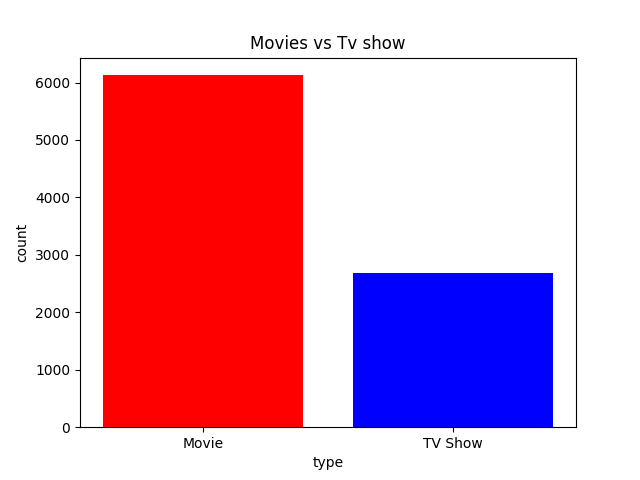
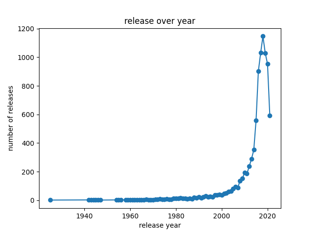
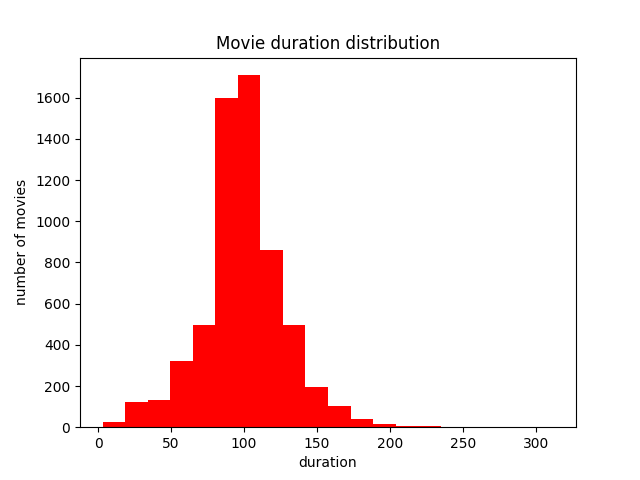

# Netflix Content Analysis

## About the Dataset

This project uses the Netflix Titles dataset containing information about movies and TV shows available on Netflix. The dataset includes:

- **Title information**: Names, descriptions, and show IDs
- **Content details**: Type (Movie/TV Show), duration, release year
- **Metadata**: Directors, cast, country of origin, date added to Netflix
- **Classifications**: Content rating, genres (listed_in)

The dataset was cleaned to remove incomplete entries and standardize the data for analysis.

## Visualizations

### 1. Movies vs TV Shows Distribution
A bar chart showing the split between movies and TV shows in Netflix's content library.

### 2. Content Rating Distribution  
A pie chart displaying how content is distributed across different rating categories (G, PG, PG-13, R, etc.).

### 3. Content Releases Over Years
A line graph tracking how many titles were released each year, showing Netflix's content acquisition patterns over time.

### 4. Movie Duration Analysis
A histogram showing the distribution of movie lengths, revealing common runtime patterns.

### 5. Top 10 Countries by Content Volume
A horizontal bar chart showing which countries produce the most content available on Netflix.

### 6. Movies vs TV Shows Timeline
A dual-line graph comparing the release patterns of movies versus TV shows over the years.

## Tech Stack

- **Python** - Programming language
- **Pandas** - Data manipulation and cleaning
- **Matplotlib** - Creating visualizations and charts
- **CSV** - Dataset format

## How to Run

1. Clone the repository
2. Install required packages: `pip install pandas matplotlib`
3. Ensure `netflix_titles.csv` is in the project directory
4. Run `python main.py`
5. Charts will be displayed and saved as PNG files

## Files

- `main.py` - Main analysis script
- `netflix_titles.csv` - Dataset (add your own)
- Generated PNG files - Visualization outputs
